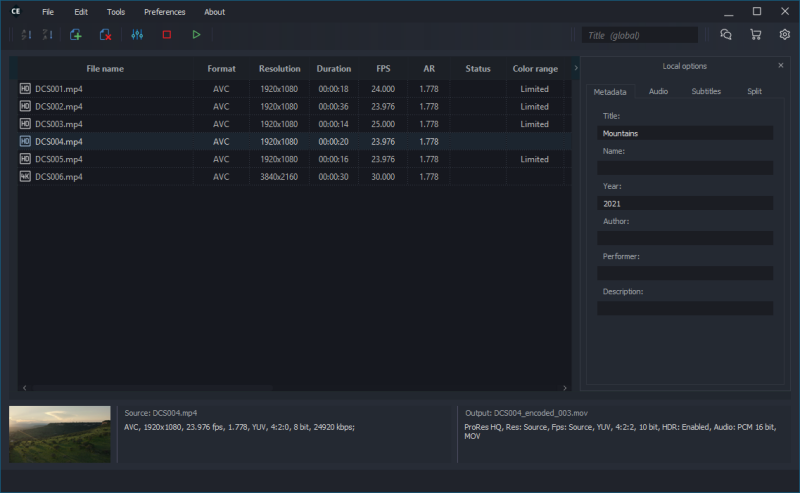

# Cine Encoder

Cine Encoder is an application, uses the FFmpeg, MKVToolNix and MediaInfo utilities, that allows to convert media files while preserving HDR metadata.  Supported hardware encoding NVENC for codecs H265, H264 and Intel QSV (for Windows and experimental for Linux) for codecs H264, MPEG-2. The following encoding modes are implemented: H265, H264, VP9, MPEG-2, XDCAM, DNxHR, ProRes



By default, there are several categories of presets. You can change existing or add your own presets.


### Installation

Supported operating system: Linux x86_64, Windows 8.1/10 x86_64

Make sure that the NVIDIA drivers are installed in accordance with the following requirements: [Using FFMPEG with NVIDIA.](https://docs.nvidia.com/video-technologies/video-codec-sdk/ffmpeg-with-nvidia-gpu/index.html)

##### - Arch Linux / Manjaro Linux:
  - install [AUR package](https://aur.archlinux.org/packages/cine-encoder/) or cine-encoder-(ver)_manjaro_x86_64.pkg.tar.xz file from [release](https://github.com/CineEncoder/cine-encoder/releases)

##### - Debian 10.6 / Ubuntu 20.04 / Linux Mint 20:
  - install file cine-encoder-(ver)_amd64.deb from [release](https://github.com/CineEncoder/cine-encoder/releases)

##### - Fedora 33:
  - to satisfy ffmpeg dependency Fedora users have to use rpmfusion (https://rpmfusion.org/)
  - install file cine-encoder-(ver)_fedora33_x86_64.rpm from [release](https://github.com/CineEncoder/cine-encoder/releases)

##### - CentOS 7.8:
  - to satisfy ffmpeg dependency CentOS users have to use rpmfusion (https://rpmfusion.org/)
  - install file cine-encoder-(ver)_centos7_x86_64.rpm from [release](https://github.com/CineEncoder/cine-encoder/releases)

*ver - current version

### Buid instructions
Install dependencies:

    - ffmpeg>=4.2
    - mkvtoolnix>=49.0
    - libmediainfo-dev>=0.7.70-1
    - qtbase5-dev>=5.3.2
    - qtmultimedia5-dev>=5.7.1


Buld package:

```sh
mkdir build
cd build
git clone https://github.com/CineEncoder/cine-encoder.git
cd cine-encoder
qmake-qt5 -o builddir/Makefile app/cine_encoder.pro -spec linux-g++ CONFIG+=qtquickcompiler (or for Debian:  /usr/lib/qt5/bin/qmake -o builddir/Makefile app/cine_encoder.pro -spec linux-g++)
cd builddir
make
```


### Tracking the development of the project

Next release version: 3.5. Estimated release date: Dec 1 2021.
To tracking the development of the project see [Project page](https://github.com/CineEncoder/cine-encoder/projects/1?fullscreen=true)


### Licence

GNU GPL v.3
See [LICENSE.md](https://github.com/CineEncoder/CineEncoder/blob/master/LICENSE)


### Donate

If you wish to support this project, you can make a donation for $0.5 or more via PayPal. Your contributions will help keep the project alive and support future development.

[](https://paypal.me/KozhukharenkoOleg?locale.x=ru_RU)

##### Bitcoin
You can send bitcoins at this address or by scanning the QR code below:


bc1ql0f3xpj57szcnn3gzr8cwajwxj880k8j4m22qv
