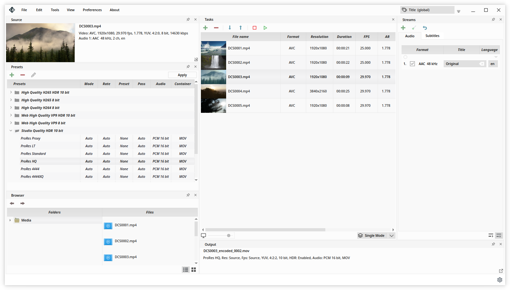

# Cine Encoder

Cine Encoder is an application, uses the FFmpeg, MKVToolNix and MediaInfo utilities, that allows to convert media files while preserving HDR metadata. Supported hardware encoding NVENC and Intel QSV (for Windows and experimental for Linux). The following encoding modes are implemented: H265, H264, VP9, MPEG-2, XDCAM, XAVC, DNxHR, ProRes.



By default, there are several categories of presets. You can change existing or add your own presets.


### Installation

Supported operating system: Linux x86_64, Windows 8.1/10 x86_64.

Make sure that the NVIDIA drivers are installed in accordance with the following requirements: [Using FFMPEG with NVIDIA.](https://docs.nvidia.com/video-technologies/video-codec-sdk/ffmpeg-with-nvidia-gpu/index.html)

##### - Arch Linux / Manjaro Linux:
  - install [AUR package](https://aur.archlinux.org/packages/cine-encoder/) or cine-encoder-(ver)_manjaro_x86_64.pkg.tar.xz file from [release](https://github.com/CineEncoder/cine-encoder/releases)

##### - Debian 10.6 / Ubuntu 20.04 / Linux Mint 20:
  - install file cine-encoder-(ver)_amd64.deb from [release](https://github.com/CineEncoder/cine-encoder/releases)

##### - Fedora 33:
  - to satisfy ffmpeg dependency Fedora users have to use rpmfusion (https://rpmfusion.org/)
  - install file cine-encoder-(ver)_fedora33_x86_64.rpm from [release](https://github.com/CineEncoder/cine-encoder/releases)

##### - CentOS 7.8:
  - to satisfy ffmpeg dependency CentOS users have to use rpmfusion (https://rpmfusion.org/)
  - install file cine-encoder-(ver)_centos7_x86_64.rpm from [release](https://github.com/CineEncoder/cine-encoder/releases)

*ver - current version

### Buid instruction for Linux
Install dependencies:

##### - Arch Linux / Manjaro Linux:
    gcc
    qt5-base
    qt5-multimedia
    qt5-svg
    qt5-x11extras
    libmediainfo
    libxext

    ffmpeg
    mkvtoolnix-cli
    intel-media-driver
    libva-intel-driver

##### - Debian / Ubuntu / Linux Mint:
    gcc
    qt5-qmake
    qtbase5-dev
    qtmultimedia5-dev
    libqt5svg5-dev
    libqt5x11extras5-dev
    libmediainfo-dev
    libxext-dev

    ffmpeg
    mkvtoolnix
    i965-va-driver

##### - Fedora / CentOS:
    gcc-c++
    qt5-qtbase-devel
    qt5-qtmultimedia-devel
    qt5-qtsvg-devel
    qt5-qtx11extras-devel
    libmediainfo-devel
    libXext-devel

    ffmpeg
    mkvtoolnix
    intel-media-driver
    libva-intel-driver

Buld package:

```sh
mkdir build
cd build
git clone https://github.com/CineEncoder/cine-encoder.git
cd cine-encoder
qmake-qt5 -o builddir/Makefile app/cine_encoder.pro -spec linux-g++ CONFIG+=qtquickcompiler (or for Debian:  /usr/lib/qt5/bin/qmake -o builddir/Makefile app/cine_encoder.pro -spec linux-g++)
cd builddir
make
```
Run:

```sh
./cine_encoder -platform xcb
```

### Buid instruction for Windows

```sh
mkdir build
cd build
git clone https://github.com/CineEncoder/cine-encoder.git
cd cine-encoder
mkdir builddir
```

Install dependencies to builddir folder:

    imageformats/qsvg.dll
    platforms/qwindows.dll
    plugins/audio/qtaudio_windows.dll
    plugins/mediaservice/qtmedia_audioengine.dll
    styles/qwindowsvistastyle.dll
    ffmpeg.exe
    libgcc_s_seh-1.dll
    libstdc++-6.dll
    libwinpthread-1.dll
    MediaInfo.dll
    MediaInfo_InfoTip.dll
    mkvpropedit.exe
    Qt5Core.dll
    Qt5Gui.dll
    Qt5Multimedia.dll
    Qt5Network.dll
    Qt5Svg.dll
    Qt5Widgets.dll
    cine-encoder.ico

Buld package:

```sh
cd builddir
<path_to_qmake>/qmake.exe ../app/cine_encoder.pro -spec win32-g++ "CONFIG+=qtquickcompiler"
<path_to_make>/mingw32-make.exe
```

### Tracking the development of the project

Next release version: 3.5. Estimated release date: Jun 18 2022.
To tracking the development of the project see [Project page](https://github.com/CineEncoder/cine-encoder/projects/1?fullscreen=true)


### Licence

GNU GPL v.3
See [LICENSE.md](https://github.com/CineEncoder/CineEncoder/blob/master/LICENSE)


### Donate

If you wish to support this project, you can make a donation  via PayPal or Ethereum. Your contributions will help keep the project alive and support future development.

[](https://paypal.me/CineEncoder?country.x=MD&locale.x=en_US)

You can send ethereum at the address below:\
0x3244195BEBabeF146F8B25369c48D90ECdcBCb8c


