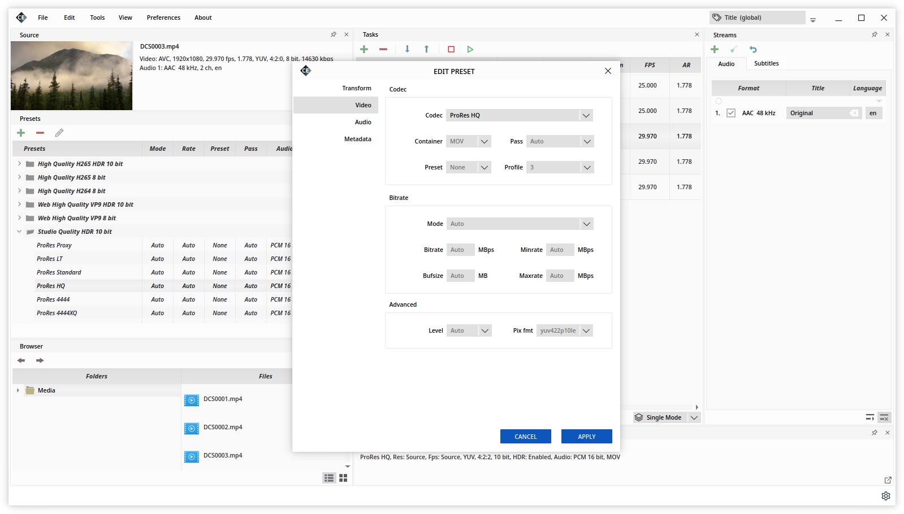

=====
About
=====

Cine Encoder is an application, uses the FFmpeg, MKVToolNix and MediaInfo utilities, that allows to convert media files while preserving HDR metadata.
Supported hardware encoding NVENC and Intel QSV (for Windows and experimental for Linux).
The following encoding modes are implemented: H265, H264, VP9, MPEG-2, XDCAM, XAVC, DNxHR, ProRes.

.. image:: ../images/View_1.png

